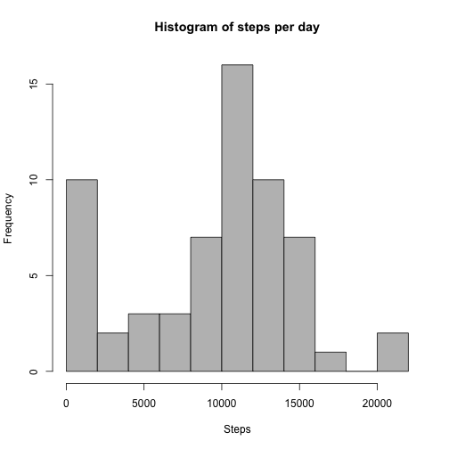
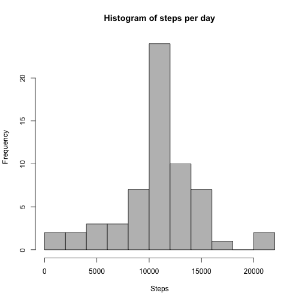
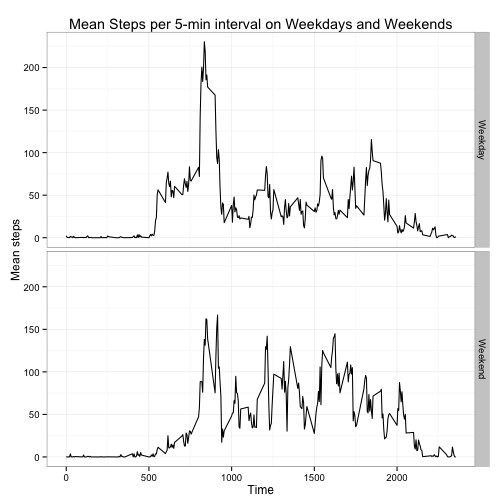

Reproducible Research: Assignment 1
====================================

Steven L. Senior

## Installing required packages
I like to use dplyr for manipulating data frames and lubridate for dealing with dates. I use ggplot2 for some of the charts. For neatness, I've commented them out below, because they produce output that isn't necessary for this project.


```r
# Install and load required packages
# install.packages(c("dplyr", "lubridate", "ggplot2"))
# library(dplyr)
# library(lubridate)
# library(ggplot2)
```

## Loading and preprocessing the data
For completeness, I have also included the code to download the zip file from the course website and unzip it.


```r
# Check if data already exists, otherwise download and unzip
if(!file.exists("activity.csv")){
	file_url <- "https://d396qusza40orc.cloudfront.net/repdata%2Fdata%2Factivity.zip"
	download.file(file_url, "activity.zip", method = "curl")
	unzip("activity.zip")
}
```

*Load the data*

```r
# Read in and preview data
activity <- read.csv("activity.csv", stringsAsFactors = F, header = T)
head(activity, n = 5)
```

```
##   steps       date interval
## 1    NA 2012-10-01        0
## 2    NA 2012-10-01        5
## 3    NA 2012-10-01       10
## 4    NA 2012-10-01       15
## 5    NA 2012-10-01       20
```

*Process/transform the data into a form that is suitable for analysis*

```r
# Convert to data.tbl then convert date to POSIXct
activity  <- activity %>% as.tbl() %>% mutate(date = ymd(date))
```

## What is mean total number of steps taken per day?

*Make a histogram of the total number of steps each day*

```r
# Group activity by date then calculate number of steps per day with summarise()
steps <- activity %>% group_by(date) %>% summarise(steps = sum(steps, na.rm = TRUE))
plot1 <- hist(steps$steps, 
		  breaks  = 15, 
		  col = "grey", 
		  main = "Histogram of steps per day",
		  xlab = "Steps")
```

 

*Calculate and report the mean and median total number of steps taken per day*

```r
mean_steps  <- mean(steps$steps)
median_steps <- median(steps$steps)
mean_steps
```

```
## [1] 9354
```

```r
median_steps
```

```
## [1] 10395
```

The mean number of steps taken each day is 9354.2295 and the median number of steps taken is 10395. I found it interesting that the default number of breaks for the histogram (5) hid quite a lot of variation in the data. Using breaks = 15 reveals this better. This suggests that many days had zero steps.

## What is the average daily activity pattern?
To answer this part, first I group the activity data by the interval variable. Then I calculate the mean for each interval. Then I plot the resulting mean using ggplot2, just for variety.

*Make a time series plot of the 5 minute interval and the average number of steps taken, averaged across all days*

```r
# Group activity by interval, then calculate mean steps for each interval using summarise()
intervals <- activity %>% group_by(interval) %>% summarise(mean_steps = mean(steps, na.rm = TRUE))

# Plot mean steps per interval using ggplot2
g1 <- ggplot(intervals, aes(interval, mean_steps))
plot2  <- (g1 
	     + geom_line() 
	     + theme_bw()
	     + labs(title = "Mean steps per 5 min interval", x = "Time", y = "Mean Steps")
	     )
plot2 ## Print the plot
```

 

*Which 5-minute interval, on average across all days in the dataset, contains the maximum number of steps?*

```r
# Find the interval with the highest average steps (actual values in text below)
max_index <- with(intervals, which(mean_steps == max(mean_steps)))
max_interval <- intervals$interval[max_index]
max_mean_steps <- intervals$mean_steps[max_index]
max_interval
```

```
## [1] 835
```

The interval that has the highest mean number of steps is 835. This interval had an average of 206.1698 steps.

## Imputing missing values

*Calculate and report the total number of missing values*

```r
num_miss <- sum(is.na(activity$steps))
num_miss
```

```
## [1] 2304
```

There are 2304 missing values in the number of steps per 5 minute interval.

*Devise a strategy for filling in all the missing values in the dataset*

To impute the missing values, I have chosen to use the mean for that 5 minute interval.

*Create a new dataset that is equal to the original dataset with the missing values filled in*

```r
# Make second corrected activity dataset
activity_imputed <- activity

# Replace each NA value with the mean steps for that time interval
for(i in 1:length(activity_imputed$steps)){
	if(is.na(activity_imputed$steps[i])){
		activity_imputed$steps[i] <- intervals$mean_steps[intervals$interval == activity$interval[i]]
	}
}

# Calculate total steps per day with imputed values
steps_imputed <- activity_imputed %>% group_by(date) %>% summarise(steps = sum(steps))
```

*Make a histogram of the total number of steps taken each day and calculate and report the mean and median total number of steps taken per day. Do these values differ from the estimates in the first part of the assignment? What is the impact of imputing missing data on the estimates of the total number of daily steps?*

```r
# Make a histogram of total steps per day with imputed values
plot3 <- hist(steps_imputed$steps,      
		  breaks  = 15, 
		  col = "grey", 
		  main = "Histogram of steps per day",
		  xlab = "Steps")
```

 

```r
# Calculate the mean and median number of steps per day with imputed values
mean_steps_imputed <- mean(steps_imputed$steps)
median_steps_imputed <- median(steps_imputed$steps)
mean_steps_imputed
```

```
## [1] 10766
```

```r
median_steps_imputed
```

```
## [1] 10766
```

The mean and median steps without imputed missing values were 9354.2295 and 10395 respectively. With imputed values, the mean and median steps were 1.0766 &times; 10<sup>4</sup> and 1.0766 &times; 10<sup>4</sup> respectively. Both of these values have been increased by imputingthe missing values. The mean steps with imputed values is 15% higher than without imputed missing values. The median number of steps is less affected, increasing by ony 3%. The distribution is also changed. This can be seen by comparing the two histograms. The distribution without imputed data is slightly left skewed (the mean is less than the median). With imputed values, the data is more symmetrical (the mean and median values are the same).

## Are there differences in activity patterns between weekdays and weekends?

*Create a new factor variable with two levels: "weekday" and "weekend"*

```r
weekend_days <- c("Saturday", "Sunday")
activity_imputed$day_type <- c(rep(NA, times = length(activity_imputed$date)))
for(i in 1:length(activity_imputed$date)){
	if(weekdays(activity_imputed$date[i]) %in% weekend_days){
		activity_imputed$day_type[i] <- "Weekend"
	}
	else{
		activity_imputed$day_type[i] <- "Weekday"
	}
}
activity_imputed <- mutate(activity_imputed, day_type = as.factor(day_type))
```

*Make a panel plot containing a time-series plot of the 5 minute interval and the average number of steps averaged across all weekdays and weekend days.*

I have chosen to facet by rows because I think that this makes it easier to compare activity between weekends and weekdays at the same times of day (i.e. the same intervals).


```r
# Group activity by interval, then calculate mean steps for each interval using summarise()
intervals_2 <- activity_imputed %>% 
			              group_by(interval, day_type) %>% 
					  summarise(mean_steps = mean(steps, na.rm = TRUE))

# Make a panel plot using day_type as the faceting variable
g2 <- ggplot(intervals_2, aes(interval, mean_steps))
plot4 <- (g2 +
	   geom_line()
	   + facet_grid(day_type ~ .)
	   + theme_bw()
	   + labs(title = "Mean Steps per 5-min interval on Weekdays and Weekends",
	   	 x = "Time",
	   	 y = "Mean steps")
	   )
plot4 ## Print the plot
```

 

The plot shows that on average, activity appears to start increasing later on weekends, and that the number of steps tends to be higher after the morning peak on weekends than on weekdays.
