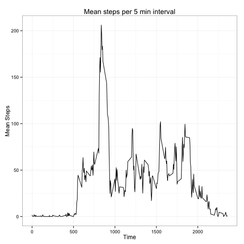

Reproducible Research: Assignment 1
====================================

Steven L. Senior


## Installing required packages
I like to use dplyr for manipulating data frames and lubridate for dealing with dates. I use ggplot2 for some of the charts.


```r
install.packages(c("dplyr", "lubridate", "ggplot2"))
```

```
## Error in install.packages : Updating loaded packages
```

```r
library(dplyr)
library(lubridate)
library(ggplot2)
```

## Loading and preprocessing the data
For completeness, I have also included the code to download the zip file from the course website and unzip it.


```r
# Check if data already exists, otherwise download and unzip
if(!file.exists("activity.csv")){
	file_url <- "https://d396qusza40orc.cloudfront.net/repdata%2Fdata%2Factivity.zip"
	download.file(file_url, "activity.zip", method = "curl")
	unzip("activity.zip")
}

# Read in and preview data
activity <- read.csv("activity.csv", stringsAsFactors = F, header = T)
head(activity, n = 5)
```

```
##   steps       date interval
## 1    NA 2012-10-01        0
## 2    NA 2012-10-01        5
## 3    NA 2012-10-01       10
## 4    NA 2012-10-01       15
## 5    NA 2012-10-01       20
```


```r
# Convert to data.tbl then convert date to POSIXct
activity  <- activity %>% as.tbl() %>% mutate(date = ymd(date))
```

## What is mean total number of steps taken per day?

*Calculate the number of steps on each day, then calculate mean for all days:*

```r
# Group activity by date then calculate number of steps per day with summarise()
steps <- activity %>% group_by(date) %>% summarise(steps = sum(steps, na.rm = TRUE))
mean_steps  <- mean(steps$steps) # Actual value given in text below
median_steps <- median(steps$steps) # Actual value given in text below
hist(steps$steps, 
     breaks  = 15, 
     col = "grey", 
     main = "Histogram of steps per day",
     xlab = "Steps")
```

 

The mean number of steps taken each day is 9354.2295 and the median number of steps taken is 10395. I found it interesting that the default number of breaks for the histogram (5) hid quite a lot of variation in the data. Using breaks = 15 reveals this better. This suggests that many days had zero steps.

## What is the average daily activity pattern?
To answer this part, first I group the activity data by the interval variable. Then I calculate the mean for each interval. Then I plot the resulting mean using ggplot2, just for variety.


```r
# Group activity by interval, then calculate mean steps for each interval using summarise()
intervals <- activity %>% group_by(interval) %>% summarise(mean_steps = mean(steps, na.rm = TRUE))

# Plot mean steps per interval using ggplot2
g <- ggplot(intervals, aes(interval, mean_steps))
plot2  <- (g 
	     + geom_line() 
	     + theme_bw()
	     + labs(title = "Mean steps per 5 min interval", x = "Time (min)", y = "Mean Steps")
	     )
plot2 ## Print the plot
```

 

```r
# Find the interval with the highest average steps (actual values in text below)
max_index <- with(intervals, which(mean_steps == max(mean_steps)))
max_interval <- intervals$interval[max_index]
max_mean_steps <- intervals$mean_steps[max_index]
```

The interval that has the highest mean number of steps is 835 (i.e. 835 minutes - 840 minutes). This interval had an average of 206.1698 steps.

## Imputing missing values


## Are there differences in activity patterns between weekdays and weekends?


